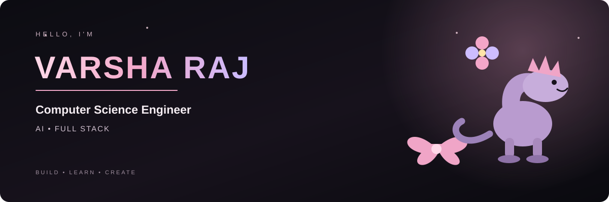
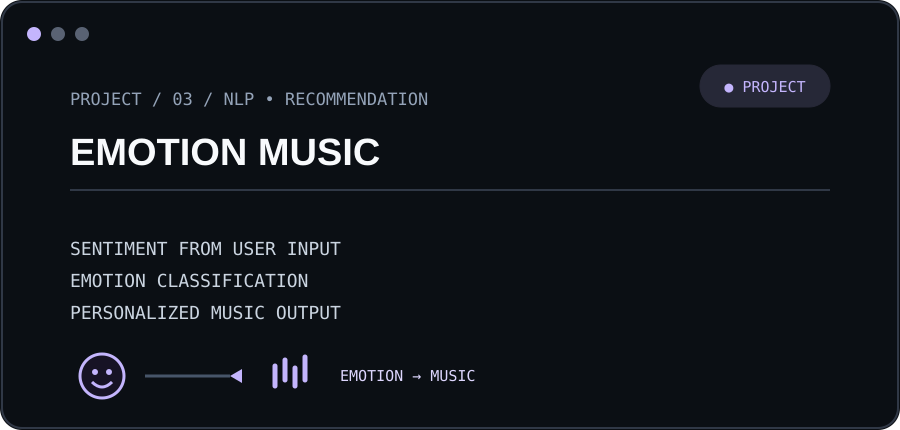

<p align="center">
  
</p>

<p align="center">
  <code>varsha@devspace:~$ whoami</code>
</p>

<p align="center">
  Computer Science Engineer • AI • FULL STACK
</p>

<br>

<div align="center">

```text
┌──[ varsha@devspace ]─[ ~/profile ]
└─$ whoami

Computer Science Engineer
AI • FULL STACK

┌──[ current_focus ]
└─$ cat focus.txt

Building intelligent products.
Learning by shipping.
Turning ideas into real-world systems.

┌──[ status ]
└─$ echo $STATUS

BUILD • LEARN • CREATE
```

</div>

<br>

<h2 align="center">⚡ PROJECT ARCHIVE</h2>

<p align="center">
  <code>varsha@devspace:~$ ls ~/projects</code>
</p>

<table>
<tr>

<td width="50%" valign="top">

<p>
  <sub>CASE 01 • PRIVACY • ENCRYPTED COLLABORATION</sub><br>
  <sub>● LIVE</sub>
</p>

<h2>SECURESPHERE</h2>

<b>Privacy-Preserving Intelligent Collaboration Platform</b>

<p>
End-to-end encrypted collaboration with secure file sharing, encrypted chat, searchable encryption and client-side intelligence.
</p>


<p>
<b>E2E</b> &nbsp; encrypted collaboration
</p>

<sub>React Native · Expo · TypeScript · PostgreSQL · Drizzle</sub>

</td>

<td width="50%" valign="top">

<p>
  <sub>CASE 02 • KITCHEN INVENTORY • HANDS-FREE</sub><br>
  <sub>● LIVE</sub>
</p>

<h2>SMART PANTRY</h2>

<b>Smart Pantry</b>

<p>
Grocery management platform tracking pantry inventory, expiration dates and consumption patterns to reduce household food waste.
</p>

<p>
Voice-based grocery entry with structured quantities and categories, plus a community marketplace for surplus food.
</p>


<p>
<b>VOICE</b> &nbsp; hands-free inventory
</p>

<sub>React · TypeScript · Tailwind CSS · Supabase · Vercel</sub>

</td>

</tr>

<tr>

<td width="50%" valign="top">

<p>
  <sub>CASE 03 • NLP • RECOMMENDATION</sub><br>
  <sub>● PROJECT</sub>
</p>

<h2>EMOTION-BASED MUSIC</h2>

<b>Emotion-Based Music Recommendation</b>

<p>
Detects emotional sentiment from user input and recommends music using a Python-based recommendation pipeline.
</p>



<p>
<b>NLP</b> &nbsp; emotion → music
</p>

<sub>Python · Flask · Pandas · TextBlob</sub>

</td>

<td width="50%" valign="top">

<p>
  <sub>CASE 04 • EXPERIMENTS • IN PROGRESS</sub><br>
  <sub>● BUILDING</sub>
</p>

<h2>MORE INCOMING</h2>

<b>Building • Learning • Creating</b>

<p>
New experiments and full-stack systems are continuously being explored and shipped.
</p>

<br>

<p>
<b>∞</b> &nbsp; next idea loading
</p>

<sub>AI · Full Stack · Open Source</sub>

</td>

</tr>
</table>

<br>

<h2 align="center">⚙️ TECH STACK</h2>

<p align="center">
  <code>varsha@devspace:~$ cat skills.txt</code>
</p>

<p align="center">
  
</p>

<div align="center">

```text
┌──[ skills ]
├── Languages → Java • Python • C++ • JavaScript • TypeScript
├── Frontend  → React • Next.js • HTML • CSS
├── Backend   → Node.js • Flask
├── Database  → PostgreSQL • MySQL
├── Cloud     → AWS • Supabase
└── Tools     → Git • GitHub • Docker • VS Code
```

</div>

<br>

<h2 align="center">🐍 CONTRIBUTION ARCHIVE</h2>

<p align="center">
  
</p>

<br>

<p align="center">
  <a href="https://github.com/varsharaj16">
    
  </a>

  <a href="https://www.linkedin.com/in/varsharaj07/">
    
  </a>

  <a href="mailto:varshar@kssem.edu.in">
    
  </a>
</p>

<p align="center">
  <sub>BUILD • LEARN • CREATE</sub>
</p>